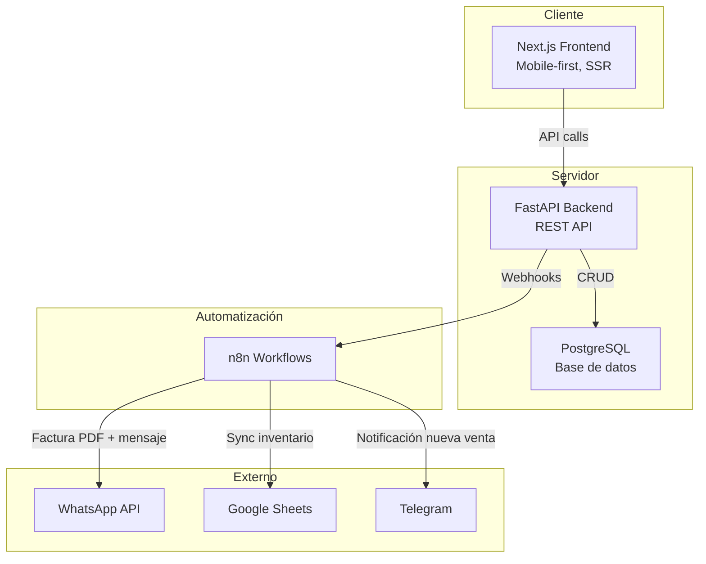
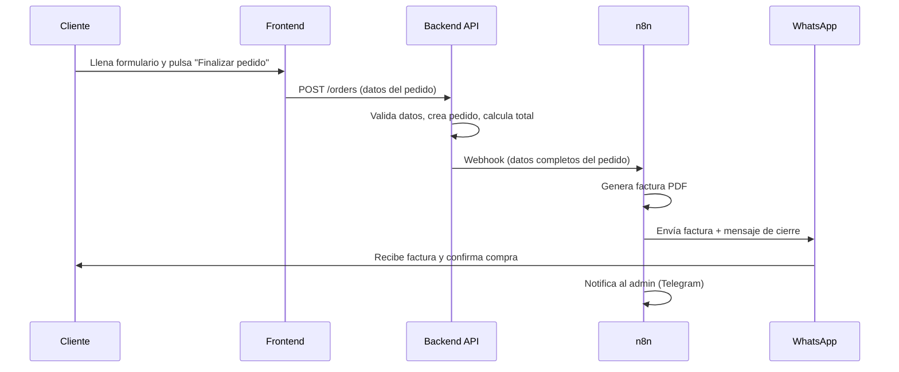

# Análisis del Producto — Plataforma E-commerce de Perfumería Fina

> Documento generado por el **Product Manager** a partir del [PRD](file:///c:/Users/jesus/Desktop/Desarrollo%20Antigravity/perfumes_2506/docs/prd.md).
> Su propósito es servir de insumo estructurado para que el **Software Architect** diseñe la arquitectura del sistema.

---

## 1. Resumen del Producto

| Campo | Detalle |
|---|---|
| **Tipo** | E-commerce especializado en perfumería fina y fragancias de autor |
| **Propuesta de valor** | Reemplazar el proceso de venta manual (redes sociales / WhatsApp) por una plataforma digital con catálogo, carrito y checkout automatizado |
| **Canal de cierre** | WhatsApp — el checkout genera una factura PDF vía n8n y la envía al cliente por WhatsApp para confirmar la compra |
| **Usuarios** | Clientes finales (sin registro obligatorio) y Administrador de la tienda |
| **Objetivo principal** | Reducir fricción de compra, organizar pedidos y ofrecer una experiencia premium mobile-first |

### Objetivos Principales

1. **Catálogo digital centralizado** — eliminar consultas repetitivas de disponibilidad y precios.
2. **Checkout sin registro** — minimizar la fricción; solo nombre, teléfono, dirección y método de pago.
3. **Cierre de venta por WhatsApp** — automatizar la generación de factura PDF y su envío al cliente.
4. **Panel administrativo** — gestionar catálogo, stock, ofertas, pedidos y métricas de ingresos.
5. **Automatizaciones operativas** — delegar notificaciones, sincronización de inventario y alertas a n8n.

---

## 2. Visión General de la Arquitectura del Sistema

| Capa | Tecnología | Responsabilidad |
|---|---|---|
| **Frontend** | Next.js (React) | Catálogo, búsqueda, filtros, carrito, checkout, panel admin |
| **Backend** | FastAPI (Python) | API REST, lógica de negocio core, autenticación admin, validaciones |
| **Base de datos** | PostgreSQL | Persistencia de catálogo, pedidos, usuarios, configuración |
| **Automatización** | n8n | Facturación, notificaciones WhatsApp/Telegram, sync con Google Sheets, carrito abandonado |
| **Infraestructura** | Despliegue en EasyPanel | Contenedores para backend, frontend, DB y n8n |

---

## 3. Funcionalidades Core (MVP)

### 3.1 Orientadas al Cliente

| # | Funcionalidad | Descripción clave |
|---|---|---|
| F1 | **Catálogo dinámico** | Grid de perfumes con foto, marca, precio y disponibilidad (disponible / últimas unidades / agotado) |
| F2 | **Filtros por familia olfativa, género y marcas** | Cítrico, Amaderado, Floral, Oriental, Dulce + Hombre, Mujer, Unisex + Marcas |
| F3 | **Buscador predictivo** | Búsqueda por nombre, marca o categoría con sugerencias en tiempo real |
| F4 | **Página / Modal de producto** | Detalle con múltiples imágenes, notas de salida/corazón/fondo, presentaciones y precios |
| F5 | **Carrito persistente** | Sidebar desplegable; selección de tamaño (30ml, 50ml, 100ml), cantidad, cálculo automático |
| F6 | **Checkout sin registro** | Formulario: nombre, teléfono, dirección/zona de envío, método de pago |
| F7 | **Cálculo de delivery** | Costo de envío calculado dinámicamente según zona |
| F8 | **Cierre vía WhatsApp** | Al finalizar → webhook n8n → factura PDF → envío automático por WhatsApp al comprador |

### 3.2 Orientadas al Administrador

| # | Funcionalidad | Descripción clave |
|---|---|---|
| A1 | **CRUD de catálogo** | Crear, editar y eliminar perfumes con sus imágenes, notas, presentaciones y precios |
| A2 | **Gestión de marcas y categorías** | ABM de marcas (nombre, país) y categorías (nombre, descripción) |
| A3 | **Gestión de stock** | Actualizar inventario por presentación |
| A4 | **Gestión de ofertas** | Crear promociones individuales, globales y por paquetes de productos |
| A5 | **Consulta de pedidos** | Listado de pedidos recibidos con estado y datos del cliente |
| A6 | **Métricas de productos** | Dashboard con métricas de rotación de productos, sugerencias de productos para ofertas con IA, notificaciones de stock bajo |
| A7 | **Métricas de ingresos** | Dashboard con métricas diarias, semanales, mensuales y anuales; exportación a Google Sheets |

### 3.3 Navegación (Menú principal)

Lo más nuevo · Hombres · Mujeres · Top 20 de la Semana · Ofertas (desplegable) · Árabes · Marcas (desplegable)

---

## 4. Componentes Técnicos

### 4.1 Backend (FastAPI)

| Módulo | Responsabilidad |
|---|---|
| `auth` | Autenticación y autorización del administrador (JWT) |
| `products` | CRUD de perfumes, presentaciones, imágenes, notas olfativas |
| `categories` | CRUD de categorías y familias olfativas |
| `brands` | CRUD de marcas |
| `orders` | Creación de pedidos, cálculo de totales, cálculo de delivery por zona |
| `promotions` | CRUD de ofertas/promociones |
| `search` | Endpoint de búsqueda con sugerencias (full-text search) |
| `webhooks` | Endpoints que disparan workflows de n8n (checkout completado, stock cambiado, etc.) |
| `metrics` | Consulta de métricas de ingresos y productos para el dashboard admin |
| `media` | Upload y gestión de imágenes de productos |
| `ai` | Endpoint que genera sugerencias de productos para ofertas con IA |

### 4.2 Frontend (Next.js)

| Área | Páginas / Componentes clave |
|---|---|
| **Tienda** | Home (hero + destacados), Listado con filtros, Página/Modal de producto, Búsqueda |
| **Carrito** | Sidebar cart (persistente en localStorage) |
| **Checkout** | Formulario de datos, resumen del pedido, botón "Finalizar pedido" |
| **Admin** | Login, Dashboard métricas, CRUD productos, Gestión stock, Ofertas, Pedidos |
| **Compartidos** | Navbar con menú de categorías, Footer, Componentes de carga/lazy loading |

### 4.3 Base de Datos (PostgreSQL)

**Entidades principales identificadas en el PRD:**

| Entidad | Campos clave |
|---|---|
| `perfume` | id, nombre, marca_id, descripción, categoría_id, género, notas_salida, notas_corazon, notas_fondo |
| `presentacion` | id, perfume_id, tamaño_ml, precio, stock |
| `marca` | id, nombre, país_origen |
| `categoria` | id, nombre, descripción |
| `imagen` | id, perfume_id, url, orden |
| `pedido` | id, cliente_nombre, cliente_telefono, dirección, zona_envío, costo_envío, total, estado, fecha |
| `pedido_item` | id, pedido_id, presentacion_id, cantidad, precio_unitario |
| `promocion` | id, tipo (individual/global/paquete), descuento, fecha_inicio, fecha_fin |
| `admin_user` | id, email, password_hash |

### 4.4 Automatización (n8n)

Detallado en la sección 6.

---

## 5. Integraciones Externas

| Integración | Canal | Uso | Gestión |
|---|---|---|---|
| **WhatsApp API** | n8n workflow | Envío automático de factura PDF y mensaje de cierre de venta al comprador | n8n |
| **Google Sheets** | n8n workflow | Sincronización bidireccional de inventario; exportación de métricas de ingresos | n8n |
| **Telegram** | n8n workflow | Notificación al dueño del negocio cuando llega un nuevo pedido | n8n |
| **Generación de PDF** | n8n workflow | Crear factura personalizada con los datos del pedido | n8n |

> [!IMPORTANT]
> Todas las integraciones externas se gestionan a través de **n8n workflows**, no mediante lógica hardcoded en el backend. El backend solo expone webhooks con los datos necesarios.

---

## 6. Oportunidades de Automatización (n8n)

| # | Workflow | Trigger | Acción |
|---|---|---|---|
| W1 | **Generación de factura** | Webhook: checkout completado | Genera PDF con datos del pedido (nombre, teléfono, dirección, productos, precios, total) |
| W2 | **Confirmación por WhatsApp** | Factura generada (encadenado a W1) | Envía la factura PDF + mensaje de cierre de venta al cliente por WhatsApp |
| W3 | **Notificación nueva venta** | Webhook: checkout completado | Envía alerta al administrador por Telegram (o panel admin) |
| W4 | **Sincronización de inventario** | Cambio en Google Sheets | Actualiza el stock del perfume en la base de datos vía API |
| W5 | **Carrito abandonado** | Timer: checkout iniciado sin finalizar en 2 horas | Envía alerta al administrador para seguimiento manual |
| W6 | **Reposición de stock** | Webhook: stock pasa de 0 a disponible | Notifica a usuarios interesados |
| W7 | **Notificación de stock bajo** | Webhook: stock baja de 10 unidades | Notifica al administrador por Telegram |

### Diagrama de flujo principal (Checkout → Factura → WhatsApp)

---

## 7. Riesgos Potenciales y Complejidad

| # | Riesgo / Complejidad | Impacto | Mitigación propuesta |
|---|---|---|---|
| R1 | **WhatsApp API** requiere cuenta de negocio verificada y aprobación de templates de mensajes | Alto — sin esto no funciona el flujo core de cierre de venta | Definir plantillas de mensaje desde el inicio; usar proveedor como Twilio o API de WhatsApp Business |
| R2 | **Generación de PDF** en n8n puede ser limitada en formato/diseño | Medio — la factura debe verse profesional y alineada con la marca | Evaluar nodos de n8n para PDF o usar un microservicio ligero que n8n invoque |
| R3 | **Sincronización bidireccional** con Google Sheets puede causar conflictos de datos | Medio — riesgo de desincronización de stock | Definir una fuente de verdad clara (DB como master) y que Sheets sea solo input/export |
| R4 | **Carrito abandonado** requiere persistencia del estado de checkout iniciado | Bajo — necesita tracking de sesión sin cuenta de usuario | Usar localStorage en frontend + endpoint que registre "checkout iniciado" en DB |
| R5 | **Cálculo de delivery por zona** requiere definir zonas y costos previamente | Bajo — pero necesita datos del negocio | Requerir al dueño una tabla de zonas/costos antes de implementar |
| R6 | **Imágenes de alta calidad** pueden impactar rendimiento | Medio — el PRD exige carga < 2 segundos | Implementar compresión, formato WebP/AVIF, CDN y lazy loading |
| R7 | **Panel admin** con métricas e IA de sugerencias es complejo para un MVP | Alto — puede retrasar el lanzamiento | Limitar MVP a métricas básicas; IA de sugerencias es mejora futura |

---

## Próximos Pasos

Este documento debe ser revisado y aprobado antes de pasar a la siguiente fase del pipeline:

**Arquitectura del Sistema → Diseño de Base de Datos → Planificación de Tareas**

El **Software Architect** tomará este análisis como input para definir la arquitectura técnica detallada.
