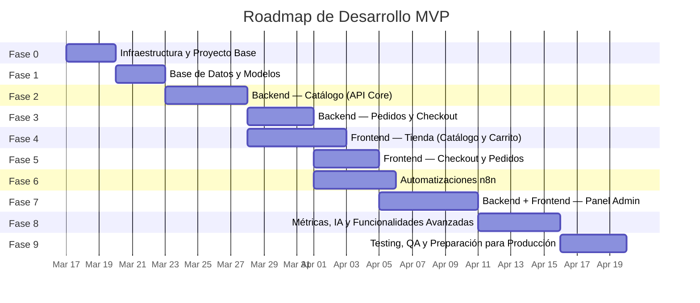
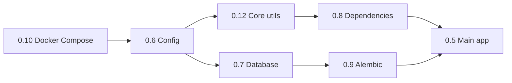
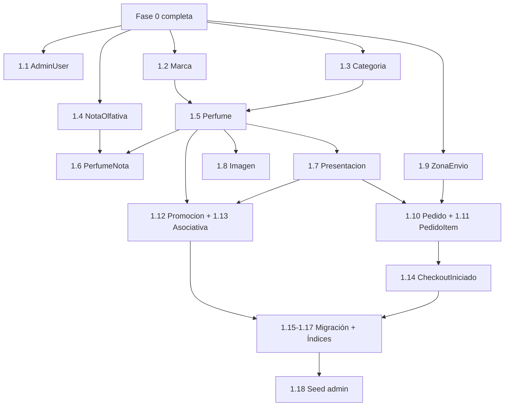
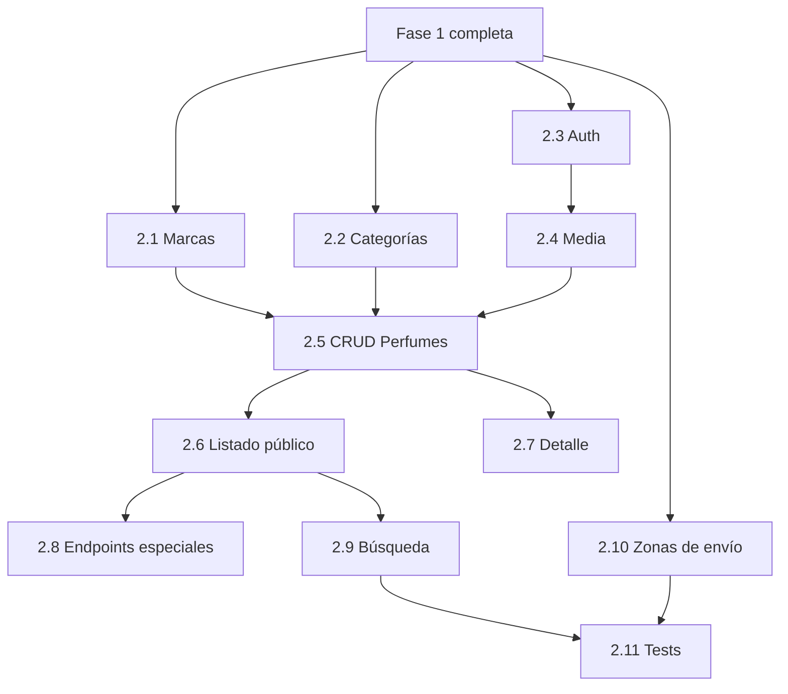
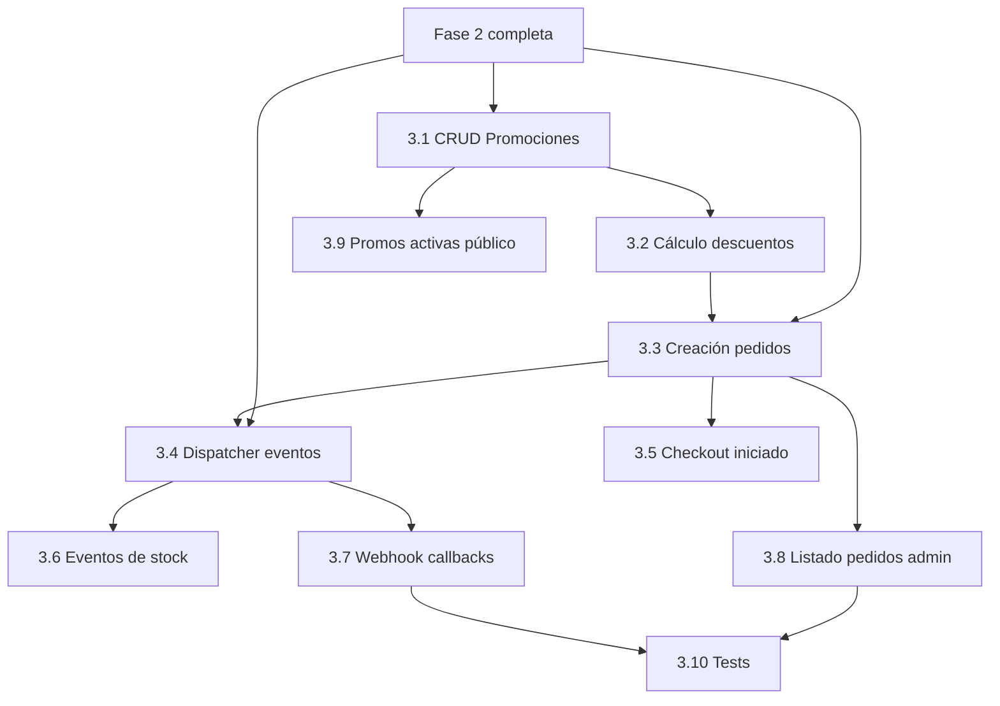
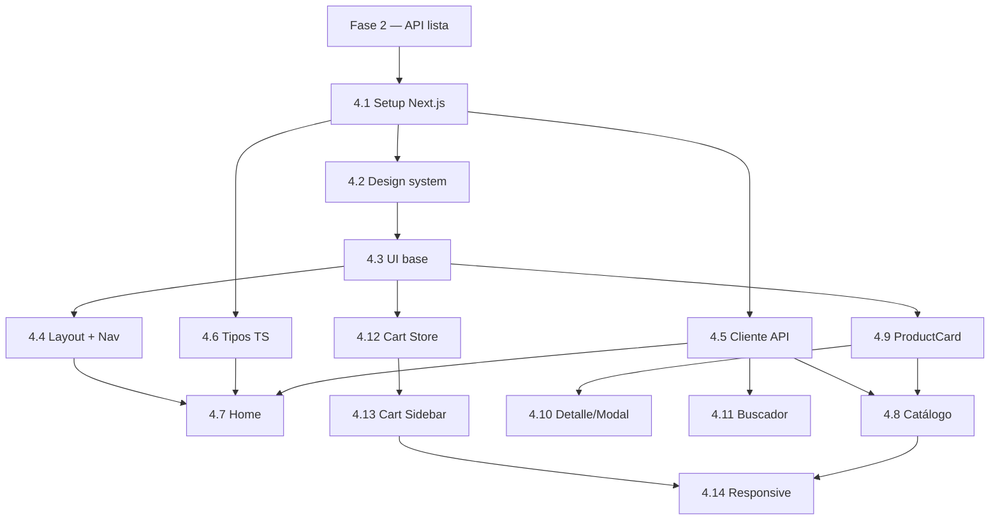
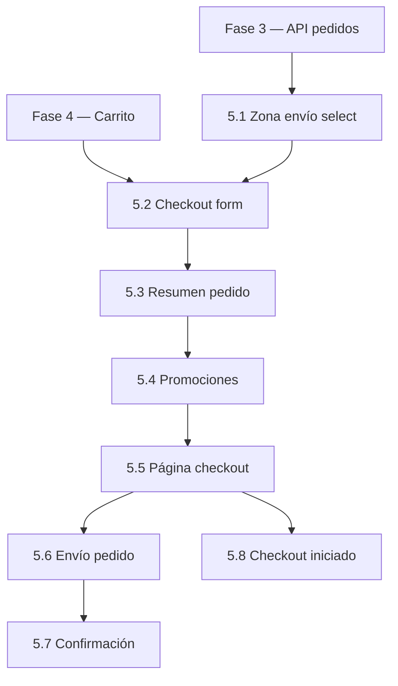
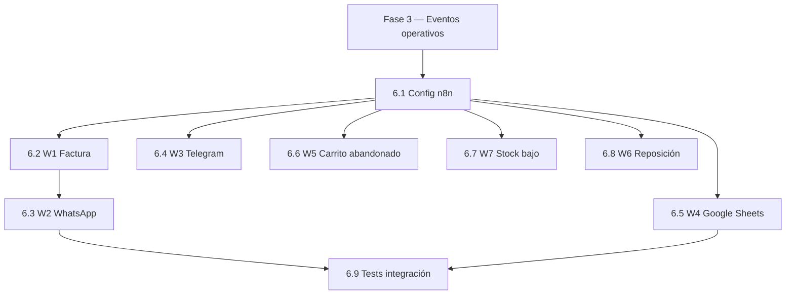
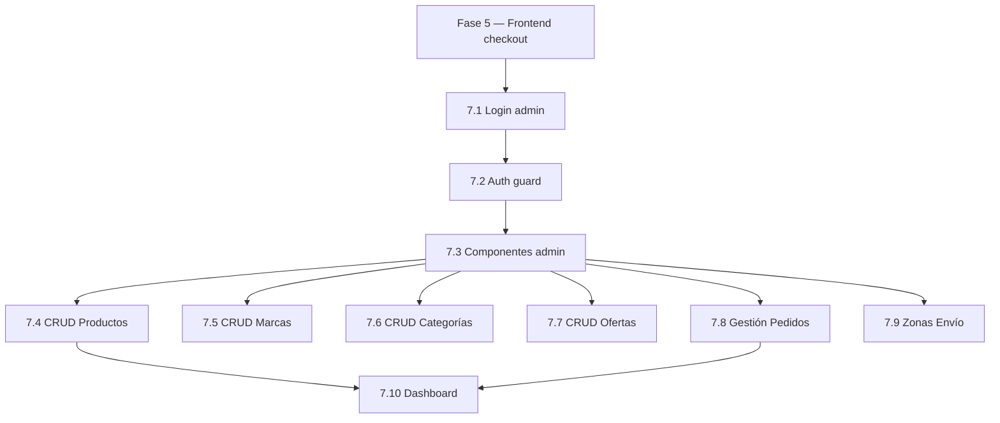
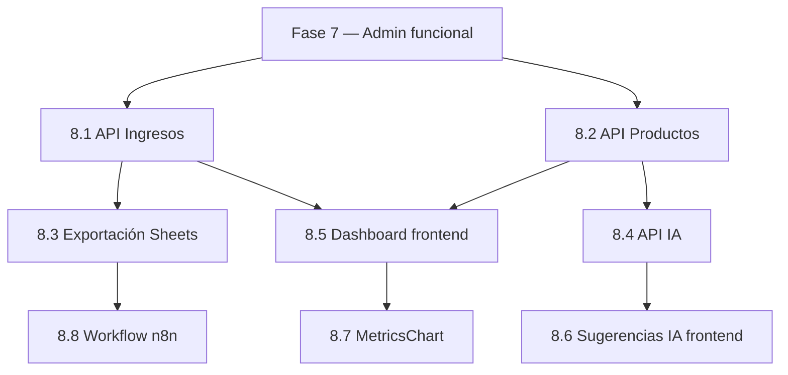

# Roadmap de Desarrollo — Plataforma E-commerce de Perfumería Fina

> Documento generado por el **Software Architect** a partir del [PRD](file:///c:/Users/jesus/Desktop/Desarrollo%20Antigravity/perfumes_2506/docs/prd.md), [Análisis del Producto](file:///c:/Users/jesus/Desktop/Desarrollo%20Antigravity/perfumes_2506/docs/product_analysis.md) y la [Arquitectura del Sistema](file:///c:/Users/jesus/Desktop/Desarrollo%20Antigravity/perfumes_2506/docs/architecture.md).
> Define el orden de implementación para construir el MVP paso a paso sin romper la arquitectura.

---

## Visión General de las Fases

> [!NOTE]
> Las fases 4 y 5 (Frontend) se pueden desarrollar en paralelo con las fases 3 y 6 respectivamente, siempre que la API correspondiente ya esté lista.

---

## Fase 0 — Infraestructura y Proyecto Base

**Objetivo:** Establecer la estructura de proyectos, configuración de entorno y verificar que los servicios base corran localmente.

### Tareas

| # | Tarea | Detalle |
|---|---|---|
| 0.1 | Inicializar repositorio Git | `.gitignore` para Python, Node, `.env`, etc. |
| 0.2 | Crear estructura de carpetas `backend/` | Según [architecture.md §3.2](file:///c:/Users/jesus/Desktop/Desarrollo%20Antigravity/perfumes_2506/docs/architecture.md): `app/`, `app/modules/`, `app/core/`, `alembic/`, `tests/` |
| 0.3 | Crear estructura de carpetas `frontend/` | Inicializar Next.js 15 con App Router + TypeScript |
| 0.4 | Configurar `backend/requirements.txt` | FastAPI, SQLAlchemy 2, Alembic, Pydantic 2, uvicorn, python-jose, passlib, bcrypt, boto3, httpx, Pillow, pytest |
| 0.5 | Crear `app/main.py` | FastAPI app factory con CORS, lifespan, prefijo `/api/v1` |
| 0.6 | Crear `app/config.py` | Pydantic `BaseSettings` con variables de entorno (DB, MinIO, JWT, n8n, OpenAI) |
| 0.7 | Crear `app/database.py` | Engine async, `SessionLocal`, `Base` declarativa |
| 0.8 | Crear `app/dependencies.py` | `get_db` (inyección de sesión), `get_current_admin` (JWT guard) |
| 0.9 | Inicializar Alembic | `alembic init`, configurar `env.py` para async |
| 0.10 | Crear `docker-compose.dev.yml` | PostgreSQL 16 + MinIO + n8n para desarrollo local |
| 0.11 | Crear `.env.example` | Template con todas las variables necesarias documentadas |
| 0.12 | Crear `app/core/` | `security.py` (JWT + hashing), `exceptions.py`, `pagination.py`, `events.py` (dispatcher n8n) |

### Criterio de Finalización

- `uvicorn app.main:app` arranca sin errores
- `GET /api/v1/health` retorna `{"status": "ok"}`
- PostgreSQL, MinIO y n8n corren en Docker
- Alembic puede ejecutar migraciones vacías

### Dependencias

---

## Fase 1 — Base de Datos y Modelos

**Objetivo:** Definir todos los modelos SQLAlchemy y generar la migración inicial con el esquema completo.

### Tareas

| # | Tarea | Modelos / Tablas |
|---|---|---|
| 1.1 | Modelo `AdminUser` | `admin_user` — id, email, password_hash, nombre, created_at, last_login |
| 1.2 | Modelo `Marca` | `marca` — id, nombre (UK), pais_origen, created_at, updated_at |
| 1.3 | Modelo `Categoria` | `categoria` — id, nombre (UK), descripcion, slug (UK), created_at |
| 1.4 | Modelo `NotaOlfativa` | `nota_olfativa` — id, nombre (UK), familia (enum) |
| 1.5 | Modelo `Perfume` | `perfume` — id, nombre, slug (UK), marca_id (FK), categoria_id (FK), genero (enum), descripcion, activo, destacado, es_arabe, es_nuevo, created_at, updated_at |
| 1.6 | Modelo `PerfumeNota` | `perfume_nota` — perfume_id (FK), nota_id (FK), tipo (enum: salida/corazón/fondo) |
| 1.7 | Modelo `Presentacion` | `presentacion` — id, perfume_id (FK), tamano_ml, precio, stock, updated_at |
| 1.8 | Modelo `Imagen` | `imagen` — id, perfume_id (FK), url, orden, es_principal |
| 1.9 | Modelo `ZonaEnvio` | `zona_envio` — id, nombre (UK), costo, activa |
| 1.10 | Modelo `Pedido` | `pedido` — id, cliente_nombre, cliente_telefono, direccion, zona_envio_id (FK), costo_envio, subtotal, descuento_total, total, estado (enum), metodo_pago, created_at, updated_at |
| 1.11 | Modelo `PedidoItem` | `pedido_item` — id, pedido_id (FK), presentacion_id (FK), cantidad, precio_unitario, descuento |
| 1.12 | Modelo `Promocion` | `promocion` — id, nombre, tipo (enum), descuento_porcentaje, descuento_fijo, fecha_inicio, fecha_fin, activa, created_at |
| 1.13 | Tabla asociativa `PromocionProducto` | Relación M:N entre promoción y perfume/presentación |
| 1.14 | Modelo `CheckoutIniciado` | `checkout_iniciado` — id, carrito_data (JSONB), cliente_telefono, finalizado, created_at, updated_at |
| 1.15 | Generar migración inicial | `alembic revision --autogenerate -m "initial_schema"` |
| 1.16 | Aplicar migración | `alembic upgrade head` |
| 1.17 | Crear índices | GIN para full-text search, B-tree para FKs y filtros frecuentes |
| 1.18 | Seed de admin por defecto | Script para crear usuario admin inicial |

### Criterio de Finalización

- `alembic upgrade head` ejecuta sin errores
- Todas las 14 tablas existen con relaciones correctas
- Admin seed se puede ejecutar

### Dependencias

---

## Fase 2 — Backend: Catálogo (API Core)

**Objetivo:** Implementar todos los endpoints necesarios para que el frontend pueda mostrar el catálogo de productos.

### Tareas

| # | Tarea | Módulo | Endpoints |
|---|---|---|---|
| 2.1 | CRUD de Marcas | `brands` | `GET /brands`, `POST /admin/brands`, `PUT /admin/brands/{id}`, `DELETE /admin/brands/{id}` |
| 2.2 | CRUD de Categorías | `categories` | `GET /categories`, `POST /admin/categories`, `PUT /admin/categories/{id}`, `DELETE /admin/categories/{id}` |
| 2.3 | Auth Admin | `auth` | `POST /auth/login`, `GET /auth/me` |
| 2.4 | Upload de imágenes | `media` | `POST /admin/media/upload`, `DELETE /admin/media/{id}` — integración con MinIO, redimensionado WebP con Pillow |
| 2.5 | CRUD de Perfumes | `products` | `POST /admin/products`, `PUT /admin/products/{id}`, `DELETE /admin/products/{id}` — con notas olfativas, presentaciones e imágenes |
| 2.6 | Listado público de productos | `products` | `GET /products` con filtros (categoría, marca, género, familia, árabe, precio, ordenamiento) y paginación |
| 2.7 | Detalle de producto | `products` | `GET /products/{slug}` — con presentaciones, notas, imágenes, relacionados |
| 2.8 | Endpoints especiales | `products` | `GET /products/featured`, `GET /products/newest`, `GET /products/top` |
| 2.9 | Búsqueda predictiva | `search` | `GET /search?q={query}` — full-text search con sugerencias |
| 2.10 | CRUD Zonas de envío | `orders` | `GET /delivery-zones`, `POST /admin/delivery-zones`, `PUT /admin/delivery-zones/{id}`, `DELETE /admin/delivery-zones/{id}` |
| 2.11 | Tests unitarios Fase 2 | `tests/` | Tests para marcas, categorías, productos, búsqueda |

### Criterio de Finalización

- Todos los endpoints responden correctamente con datos de prueba
- Filtros y paginación funcionan
- Full-text search retorna resultados relevantes
- Imágenes se suben a MinIO y se sirven
- Tests unitarios pasan

### Dependencias

---

## Fase 3 — Backend: Pedidos y Checkout

**Objetivo:** Implementar el flujo completo de creación de pedidos, cálculo de totales, promociones y disparar eventos hacia n8n.

### Tareas

| # | Tarea | Módulo | Detalle |
|---|---|---|---|
| 3.1 | CRUD de Promociones | `promotions` | Crear, actualizar, eliminar promociones (individual/global/paquete), listado de activas |
| 3.2 | Cálculo de descuentos | `promotions` | Servicio que recibe un carrito y retorna descuentos aplicables según promociones activas |
| 3.3 | Creación de pedidos | `orders` | `POST /orders` — validar stock, calcular subtotales, aplicar descuentos, calcular envío por zona, crear pedido + items, decrementar stock |
| 3.4 | Dispatcher de eventos | `webhooks` | Implementar `core/events.py` — enviar HTTP POST a n8n con payloads (`order_completed`, `low_stock`, etc.) |
| 3.5 | Registro de checkout iniciado | `orders` | Endpoint para registrar `CHECKOUT_INICIADO` (carrito abandonado) |
| 3.6 | Eventos de stock | `webhooks` | Detectar `low_stock` (< 10) y `stock_replenished` (0 → > 0) al modificar stock |
| 3.7 | Webhook callbacks (n8n → Backend) | `webhooks` | `POST /webhooks/n8n/order-status`, `POST /webhooks/n8n/stock-update` |
| 3.8 | Listado de pedidos admin | `orders` | `GET /admin/orders`, `GET /admin/orders/{id}`, `PATCH /admin/orders/{id}/status` |
| 3.9 | Promociones activas público | `promotions` | `GET /promotions/active` |
| 3.10 | Tests unitarios Fase 3 | `tests/` | Tests para pedidos, promociones, cálculos, eventos |

### Criterio de Finalización

- Se puede crear un pedido completo con descuentos y envío
- El stock se decrementa correctamente
- Los eventos se disparan por HTTP hacia n8n (puede verificarse con un mock server)
- Admin puede ver y gestionar pedidos
- Tests unitarios pasan

### Dependencias

---

## Fase 4 — Frontend: Tienda (Catálogo y Carrito)

**Objetivo:** Construir la interfaz pública de la tienda: home, catálogo con filtros, detalle de producto y carrito.

> **Requisito previo:** Fase 2 completa (API de catálogo disponible).

### Tareas

| # | Tarea | Detalle |
|---|---|---|
| 4.1 | Setup del proyecto Next.js | Inicializar con App Router + TypeScript, instalar dependencias (Zustand, React Hook Form, Zod) |
| 4.2 | Design system base | `variables.css` (colores, tipografía, espaciado), `globals.css`, `reset.css` — inspirado en diseño minimalista/elegante del PRD |
| 4.3 | Componentes UI base | `Button`, `Input`, `Modal`, `Card`, `Badge`, `Dropdown`, `Skeleton` |
| 4.4 | Layout y navegación | `Navbar` con menú de categorías (Lo más nuevo, Hombres, Mujeres, Top 20, Ofertas, Árabes, Marcas), `Footer` |
| 4.5 | Cliente API | `lib/api.ts` — fetch wrapper con tipado para todos los endpoints |
| 4.6 | Tipos TypeScript | `types/product.ts`, `types/order.ts`, `types/api.ts` |
| 4.7 | Página Home | Hero banner, sección de perfumes destacados, categorías rápidas, Top 20 |
| 4.8 | Página de Catálogo | `ProductGrid`, `ProductFilters` (categoría, género, marca, familia, precio), paginación, ordenamiento |
| 4.9 | Componente `ProductCard` | Foto, nombre, marca, precio, badge de disponibilidad, hover effects |
| 4.10 | Página / Modal de Producto | Galería de imágenes, notas olfativas (salida/corazón/fondo con badges), selector de presentación, botón "Añadir al carrito" |
| 4.11 | Buscador predictivo | `SearchBar` con sugerencias desplegables en tiempo real |
| 4.12 | Zustand Cart Store | `cartStore.ts` — add, remove, update quantity, clear, persistir en localStorage |
| 4.13 | Cart Sidebar | `CartSidebar` desplegable con `CartItem`, `CartSummary`, botón "Ir a checkout" |
| 4.14 | Responsive y optimización | Mobile-first responsive, lazy loading de imágenes, optimización de WebP con `next/image` |

### Criterio de Finalización

- La tienda se renderiza con datos reales de la API
- Los filtros y la búsqueda funcionan
- Se pueden añadir productos al carrito y se persisten en localStorage
- El diseño es responsive y se alinea con las referencias en `design/`
- Tiempo de carga < 2 segundos

### Dependencias

---

## Fase 5 — Frontend: Checkout y Pedidos

**Objetivo:** Implementar el flujo de checkout: formulario de datos, cálculo de envío, confirmación y finalización del pedido.

> **Requisito previo:** Fase 3 (API de pedidos) + Fase 4 (carrito funcional).

### Tareas

| # | Tarea | Detalle |
|---|---|---|
| 5.1 | Selector de zona de envío | `DeliveryZoneSelect` — carga zonas desde API, muestra costo |
| 5.2 | Formulario de checkout | `CheckoutForm` con React Hook Form + Zod — nombre, teléfono, dirección, zona, método de pago |
| 5.3 | Resumen del pedido | `OrderSummary` — productos, cantidades, precios, descuentos aplicados, envío, total |
| 5.4 | Aplicación de promociones | Mostrar descuentos activos en el resumen del pedido |
| 5.5 | Página de checkout completa | Integrar todos los componentes, validación, botón "Finalizar pedido" |
| 5.6 | Envío del pedido | `POST /orders` — manejar respuesta exitosa (confirmación) y errores (stock agotado, etc.) |
| 5.7 | Página de confirmación | Pantalla post-checkout: "Tu pedido ha sido registrado. Te contactaremos por WhatsApp." |
| 5.8 | Registro de checkout iniciado | Al entrar al checkout, enviar datos al backend para tracking de abandono |

### Criterio de Finalización

- El flujo completo de checkout funciona end-to-end
- Los datos del pedido llegan correctamente al backend
- El stock se actualiza tras el pedido
- Se muestra confirmación al usuario
- Los errores se manejan correctamente (stock insuficiente, validación)

### Dependencias

---

## Fase 6 — Automatizaciones n8n

**Objetivo:** Configurar los workflows de n8n que procesan los eventos del sistema.

> **Requisito previo:** Fase 3 (dispatcher de eventos y webhooks operativos).

### Tareas

| # | Tarea | Workflow | Detalle |
|---|---|---|---|
| 6.1 | Config base n8n | — | Configurar credenciales (WhatsApp Business API, Telegram Bot, Google Sheets, MinIO) |
| 6.2 | W1: Generación de factura PDF | Factura | Webhook trigger → formatear datos → HTML to PDF → guardar en MinIO |
| 6.3 | W2: Confirmación por WhatsApp | WhatsApp | Trigger encadenado a W1 → construir mensaje con template → adjuntar PDF → enviar vía WhatsApp Business API |
| 6.4 | W3: Notificación nueva venta | Telegram | Webhook trigger (`order_completed`) → formatear resumen → enviar a Telegram Bot |
| 6.5 | W4: Sincronización inventario | Google Sheets | Google Sheets trigger (row updated) → leer datos → PATCH stock vía API backend |
| 6.6 | W5: Carrito abandonado | Alerta admin | Schedule trigger (cada 30 min) → query checkouts sin finalizar > 2h → alerta Telegram |
| 6.7 | W7: Notificación stock bajo | Telegram | Webhook trigger (`low_stock`) → formatear alerta → enviar a Telegram |
| 6.8 | W6: Reposición de stock | Notificación | Webhook trigger (`stock_replenished`) → buscar interesados → notificar |
| 6.9 | Tests de integración | — | Verificar que cada workflow se ejecuta correctamente con datos de prueba |

### Criterio de Finalización

- Crear un pedido de prueba genera factura PDF y la envía por WhatsApp
- El admin recibe notificación por Telegram al crear un pedido
- Cambiar datos en Google Sheets actualiza el stock en la BD
- Carritos abandonados generan alerta después de 2 horas
- Stock bajo genera notificación al admin

### Dependencias

---

## Fase 7 — Backend + Frontend: Panel Administrativo

**Objetivo:** Implementar la interfaz de administración para gestionar catálogo, pedidos, marcas, categorías y ofertas.

> **Requisito previo:** Fase 5 (frontend funcional con Checkout) + APIs admin de Fase 2 y 3.

### Tareas

| # | Tarea | Detalle |
|---|---|---|
| 7.1 | Login admin frontend | Página `/admin/login`, formulario email/password, guardar JWT |
| 7.2 | Auth guard layout | Layout admin con verificación de JWT, redirect a login si no autenticado |
| 7.3 | Componentes admin reutilizables | `AdminTable` (listado con paginación, búsqueda, acciones), `ProductForm` (formulario dinámico) |
| 7.4 | CRUD Productos (frontend) | Listado, crear, editar, eliminar perfumes con upload de imágenes, notas, presentaciones |
| 7.5 | CRUD Marcas (frontend) | Listado, crear, editar, eliminar marcas |
| 7.6 | CRUD Categorías (frontend) | Listado, crear, editar, eliminar categorías |
| 7.7 | CRUD Ofertas (frontend) | Listado, crear, editar, eliminar promociones con selector de tipo |
| 7.8 | Gestión de Pedidos (frontend) | Listado de pedidos con filtros por estado, detalle de pedido, cambio de estado |
| 7.9 | Gestión de Zonas de Envío | Listado, crear, editar, eliminar zonas con costos |
| 7.10 | Dashboard admin | Página principal con resumen: pedidos recientes, stock bajo, ingresos del día |

### Criterio de Finalización

- Admin puede loguearse y gestionar todo el catálogo desde la interfaz
- Todas las operaciones CRUD funcionan end-to-end
- Pedidos se pueden consultar y cambiar de estado
- La interfaz es intuitiva y responsive

### Dependencias

---

## Fase 8 — Métricas, IA y Funcionalidades Avanzadas

**Objetivo:** Implementar dashboards de métricas, sugerencias con IA y funcionalidades que complementan el MVP.

> **Requisito previo:** Fase 7 (panel admin funcional).

### Tareas

| # | Tarea | Módulo | Detalle |
|---|---|---|---|
| 8.1 | API Métricas de Ingresos | `metrics` | `GET /admin/metrics/income` — ingresos diarios, semanales, mensuales, anuales |
| 8.2 | API Métricas de Productos | `metrics` | `GET /admin/metrics/products` — rotación, top vendidos, stock bajo |
| 8.3 | Exportación a Google Sheets | `metrics` | `GET /admin/metrics/export` — disparar workflow n8n para exportar |
| 8.4 | API Sugerencias con IA | `ai` | `POST /admin/ai/suggestions` — enviar datos de inventario/ventas a LLM, retornar sugerencias de ofertas |
| 8.5 | Dashboard Métricas (frontend) | Admin | Página con gráficos de ingresos (por período), top productos, alertas de stock bajo |
| 8.6 | Panel de Sugerencias IA (frontend) | Admin | Sección en métricas con sugerencias de promociones generadas por IA |
| 8.7 | Componente `MetricsChart` | Admin | Gráficos reutilizables (ingresos, rotación) |
| 8.8 | Workflow n8n: Exportar métricas | n8n | Webhook trigger → consultar API métricas → formatear → escribir Google Sheets |

### Criterio de Finalización

- Dashboard muestra métricas reales con datos agregados
- Se pueden generar sugerencias de ofertas con IA
- Se puede exportar a Google Sheets
- Gráficos son interactivos y responsive

### Dependencias

---

## Fase 9 — Testing, QA y Preparación para Producción

**Objetivo:** Validar el sistema completo, corregir bugs, optimizar rendimiento y preparar para producción.

### Tareas

| # | Tarea | Detalle |
|---|---|---|
| 9.1 | Tests de integración backend | Tests end-to-end de flujos completos: catálogo → carrito → checkout → pedido → evento |
| 9.2 | Tests E2E frontend | Playwright: flujo de compra completo, panel admin, responsive |
| 9.3 | Code Review | Revisar arquitectura, calidad de código, naming, modularidad |
| 9.4 | Security Audit | OWASP Top 10, validación de inputs, protección XSS/SQLi, auth/authz, HTTPS |
| 9.5 | Optimización de rendimiento | Lighthouse audit, optimización de imágenes, lazy loading, cacheo |
| 9.6 | Dockerfiles de producción | Optimizar multi-stage builds para backend y frontend |
| 9.7 | Configurar EasyPanel | Crear servicios en EasyPanel, configurar dominios, SSL, variables de entorno |
| 9.8 | Migración de datos iniciales | Cargar datos reales del catálogo de perfumes |
| 9.9 | Pruebas en staging | Desplegar en EasyPanel, verificar todos los flujos en entorno real |
| 9.10 | Documentación final | README de despliegue, guía de uso admin, documentación de API (Swagger auto) |

### Criterio de Finalización

- Todos los tests pasan (unitarios, integración, E2E)
- No hay vulnerabilidades críticas
- Rendimiento < 2 segundos de carga
- Desplegado en EasyPanel y funcionando

---

## Hitos Técnicos (Milestones)

| Hito | Fase | Entregable | Verificación |
|---|---|---|---|
| **M0** | Fase 0 | Infraestructura operativa | `GET /health` responde `200 OK`, Docker Compose funcional |
| **M1** | Fase 1 | Esquema de BD completo | 14 tablas creadas, relaciones correctas, admin seed funcional |
| **M2** | Fase 2 | API del catálogo funcional | Postman/Swagger: CRUD productos, filtros, búsqueda, upload imágenes |
| **M3** | Fase 3 | API de pedidos funcional | Crear pedido end-to-end, stock se decrementa, eventos se disparan |
| **M4** | Fase 4 | Tienda funcional (frontend) | Tienda navegable con datos reales, carrito funcional |
| **M5** | Fase 5 | Checkout funcional (frontend) | Flujo completo desde carrito hasta confirmación de pedido |
| **M6** | Fase 6 | Automatizaciones operativas | Factura por WhatsApp, notificaciones Telegram, sync Sheets |
| **M7** | Fase 7 | Panel admin funcional | Gestión completa de catálogo, pedidos, ofertas desde la interfaz |
| **M8** | Fase 8 | Métricas e IA | Dashboard con datos reales, sugerencias de ofertas |
| **M9** | Fase 9 | **MVP LISTO PARA PRODUCCIÓN** | Tests pasan, seguridad auditada, desplegado en EasyPanel |

---

## Criterios de Finalización del MVP

El MVP se considera **completo y listo para producción** cuando se cumplan TODOS los siguientes criterios:

### Funcional

- [ ] El cliente puede navegar el catálogo, filtrar, buscar y ver detalles de perfumes
- [ ] El cliente puede añadir productos al carrito y el carrito persiste entre sesiones
- [ ] El cliente puede completar el checkout sin registro (nombre, teléfono, dirección, zona)
- [ ] El pedido genera una factura PDF automática y se envía por WhatsApp
- [ ] El admin puede loguearse y gestionar catálogo, stock, marcas, categorías y ofertas
- [ ] El admin puede ver y gestionar pedidos
- [ ] El admin puede ver métricas de ingresos y productos
- [ ] Las promociones se aplican correctamente
- [ ] Las zonas de envío se calculan correctamente
- [ ] Las notificaciones llegan por Telegram al admin

### Técnico

- [ ] Arquitectura modular (FastAPI + Next.js) según `architecture.md`
- [ ] Base de datos con todas las entidades y relaciones definidas
- [ ] API RESTful con todos los endpoints documentados (Swagger)
- [ ] Tests unitarios y de integración con cobertura ≥ 70%
- [ ] Tests E2E con Playwright para flujos críticos
- [ ] Imágenes optimizadas (WebP, thumbnails, lazy loading)
- [ ] Tiempo de carga < 2 segundos (Lighthouse Performance ≥ 80)

### Seguridad

- [ ] Autenticación JWT para admin con contraseñas hasheadas (bcrypt)
- [ ] Validación de todos los inputs (Pydantic + Zod)
- [ ] Protección contra XSS y SQL injection
- [ ] HTTPS habilitado en producción
- [ ] Variables de entorno para datos sensibles (nunca en código)

### Despliegue

- [ ] Desplegado en EasyPanel con dominios configurados y SSL
- [ ] PostgreSQL, MinIO y n8n operativos como servicios
- [ ] Workflow de factura y WhatsApp probados en producción
- [ ] Datos iniciales del catálogo cargados
- [ ] README con instrucciones de despliegue y guía de uso admin

### Pipeline Completado

- [ ] PRD aprobado ✓
- [ ] Análisis de producto ✓
- [ ] Arquitectura diseñada ✓
- [ ] Roadmap definido ✓
- [ ] Base de datos diseñada
- [ ] Desarrollo completado
- [ ] Tests ejecutados y aprobados
- [ ] Code review aprobado
- [ ] Security audit completado
- [ ] Refactoring aplicado (si necesario)
