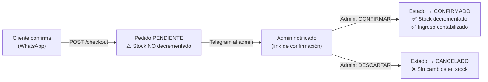

# Fase 5 — Panel de Administración + Sistema de Confirmación de Pedidos

## Objetivo

Construir el Panel de Administración de la plataforma y re-diseñar el ciclo de vida de los pedidos para prevenir "compras fantasmas": registros inflados en stock/ingresos de compras que nunca se concretaron realmente.

## Diagnóstico del problema actual

El flujo actual de [create_order](file:///c:/Users/jesus/Desktop/Desarrollo%20Antigravity/perfumes_2506/backend/app/modules/orders/router.py#30-42) en el backend **decrementa el stock en el momento que el cliente presiona "Confirmar Pedido vía WhatsApp"** — antes de que haya confirmado el pago. Esto genera:

- **Stock reducido** sin que el pago se haya concretado.
- **Ingresos inflados** que incluyen pedidos que nunca se completaron.
- **Sin trazabilidad** de qué pedidos se concretaron realmente.

## Solución: Ciclo de Vida de 2 Fases

> [!IMPORTANT]
> **Cambio crítico en backend**: Mover la lógica de decremento de stock de [create_order](file:///c:/Users/jesus/Desktop/Desarrollo%20Antigravity/perfumes_2506/backend/app/modules/orders/router.py#30-42) al nuevo `confirm_order`. El pedido recién creado solo existirá en DB como registro "congelado" hasta que el admin tome acción.

---

## Cambios Propuestos

### A. Backend — Ciclo de Vida de Pedidos

#### [MODIFY] [service.py](file:///c:/Users/jesus/Desktop/Desarrollo%20Antigravity/perfumes_2506/backend/app/modules/orders/service.py)
- Eliminar el decremento de stock de [create_order](file:///c:/Users/jesus/Desktop/Desarrollo%20Antigravity/perfumes_2506/backend/app/modules/orders/router.py#30-42).
- Nueva función `confirm_order(db, order_id)`: cambia estado a CONFIRMADO y decrementa stock.
- Nueva función `discard_order(db, order_id)`: cambia estado a CANCELADO (sin tocar stock).
- Validación: solo se puede confirmar/descartar un pedido en estado PENDIENTE.

#### [MODIFY] [router.py](file:///c:/Users/jesus/Desktop/Desarrollo%20Antigravity/perfumes_2506/backend/app/modules/orders/router.py)
- `POST /admin/orders/{order_id}/confirm` — confirmar pedido (admin only).
- `POST /admin/orders/{order_id}/discard` — descartar pedido (admin only).
- `GET /admin/orders` — ya existe, añadir filtros por estado.
- Ruta pública `GET /confirm/{token}` para link de Telegram (opcional, ver sección Telegram).

#### [MODIFY] [config.py](file:///c:/Users/jesus/Desktop/Desarrollo%20Antigravity/perfumes_2506/backend/app/config.py)
- Añadir `TELEGRAM_BOT_TOKEN`, `TELEGRAM_CHAT_ID`, `ADMIN_BASE_URL`.

---

### B. Backend — Notificación por Telegram

Cuando se crea un nuevo pedido ([create_order](file:///c:/Users/jesus/Desktop/Desarrollo%20Antigravity/perfumes_2506/backend/app/modules/orders/router.py#30-42)), el backend enviará un mensaje de Telegram al propietario con:

1. Resumen del pedido (cliente, total, productos).
2. Link directo al panel de admin: `https://tudominio.com/admin/orders/{id}`.
3. (Opcional futuro): Botones inline de Telegram para confirmar/descartar.

#### [NEW] [telegram.py](file:///c:/Users/jesus/Desktop/Desarrollo Antigravity/perfumes_2506/backend/app/core/telegram.py)
- Función `send_order_alert(order)` — envía HTTP a la Bot API de Telegram con `sendMessage`.

---

### C. Frontend — Panel de Administración

Se creará en `/admin` dentro del proyecto Next.js existente.

#### [NEW] `frontend/src/app/admin/layout.tsx`
- Layout con sidebar de navegación (Pedidos, Productos, Marcas, Categorías, Promociones, Zonas de Envío).
- Guard de autenticación JWT que redirige a `/admin/login` si no hay sesión.

#### [NEW] `frontend/src/app/admin/login/page.tsx`
- Formulario email + contraseña que llama a `POST /api/v1/admin/login`.
- Guarda el JWT en localStorage.

#### [NEW] `frontend/src/app/admin/orders/page.tsx`
- Tabla de pedidos con filtro por estado (PENDIENTE, CONFIRMADO, CANCELADO, etc.).
- Pestañas de alerta visual para pedidos PENDIENTES sin atender.
- Botones "Confirmar" y "Descartar" en cada fila de pedido pendiente.

#### [NEW] `frontend/src/app/admin/orders/[id]/page.tsx`
- Vista detallada de un pedido.
- Botones de acción: Confirmar / Descartar.
- Timeline del historial del pedido (estado actual + timestamps).

#### [NEW] `frontend/src/app/admin/products/page.tsx`
- CRUD de Perfumes con tabla paginada, creación, edición y eliminación.

#### [NEW] `frontend/src/app/admin/dashboard/page.tsx`
- Métricas básicas: ingresos totales (solo confirmados), pedidos del día, stock bajo.

---

## Orden de Implementación

1. **Backend**: Modificar [create_order](file:///c:/Users/jesus/Desktop/Desarrollo%20Antigravity/perfumes_2506/backend/app/modules/orders/router.py#30-42) — quitar decremento de stock.
2. **Backend**: Implementar `confirm_order` y `discard_order` con decremento de stock.
3. **Backend**: Implementar módulo `telegram.py` + integrar en [create_order](file:///c:/Users/jesus/Desktop/Desarrollo%20Antigravity/perfumes_2506/backend/app/modules/orders/router.py#30-42).
4. **Backend**: Añadir variables `TELEGRAM_BOT_TOKEN`, `TELEGRAM_CHAT_ID` a [config.py](file:///c:/Users/jesus/Desktop/Desarrollo%20Antigravity/perfumes_2506/backend/app/config.py).
5. **Backend**: Añadir rutas `/admin/orders/{id}/confirm` y `/admin/orders/{id}/discard`.
6. **Frontend**: Módulo Auth (login + store JWT + guard).
7. **Frontend**: Admin Layout (sidebar + auth guard).
8. **Frontend**: Página de pedidos (`/admin/orders`) con tabla + acciones.
9. **Frontend**: Detalle de pedido (`/admin/orders/[id]`).
10. **Frontend**: Dashboard básico de métricas.
11. **Frontend**: CRUD de Productos (básico).

---

## Variables de Entorno Requeridas

| Variable | Dónde obtenerla |
|---|---|
| `TELEGRAM_BOT_TOKEN` | Crear bot en @BotFather en Telegram |
| `TELEGRAM_CHAT_ID` | Usar @userinfobot para obtener tu chat_id |
| `ADMIN_BASE_URL` | URL pública del frontend (e.g. `https://tutienda.com`) |

> [!NOTE]
> El `TELEGRAM_CHAT_ID` es el ID de la conversación donde quieres recibir la alerta. Puede ser tu chat personal o un grupo privado. Si aún no tienes el token ni el chat_id, el módulo fallará silenciosamente (sin bloquear el checkout).

---

## Plan de Verificación

1. Crear una orden desde el frontend y verificar que el stock **NO** se decrementa.
2. Confirmar la orden desde `/admin/orders` y verificar que el stock **SÍ** se decrementa.
3. Descartar una orden y verificar que el stock queda intacto.
4. Login de admin funciona y protege las rutas `/admin/*`.
5. Notificación de Telegram llega al crear una orden.
